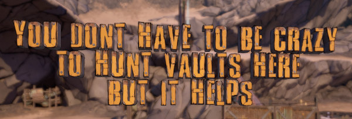
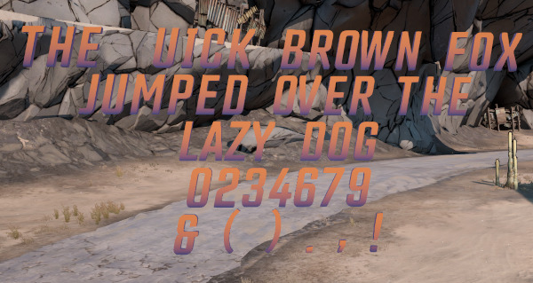
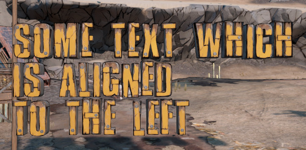
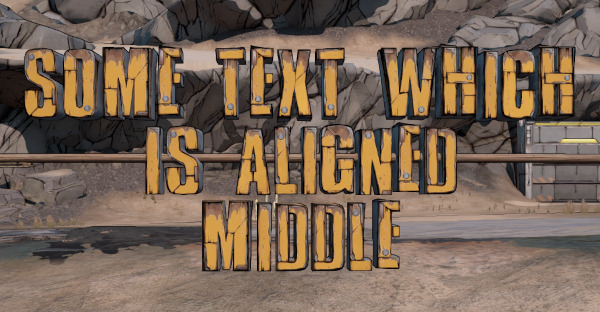

StaticMesh Text Blocks
======================



* [Overview](#overview)
* [Basic Usage](#basic-usage)
* [Available Fonts](#available-fonts)
* [Rotations](#rotations)
* [Alignment](#alignment)
* [Scaling](#scaling)
* [Compass](#compass)
* [TODO](#todo)

Overview
--------

The game data includes two sets of StaticMesh letters, which can be used as
"fonts" to write out text blocks in the game world.  This would be incredibly
cumbersome to do by hand, even with the `mesh_hotfix` method, so a separate
library is available to make it much easier.

Basic Usage
-----------

This library lives inside the `bl3hotfixmod` subdir, and works alongside the
main mod-writing helper there.  To use this in your apps, include the
following among your Python module imports:

```python
from bl3hotfixmod.textmesh import TextMesh
```

The most basic usage of the library would be adding a single line of
text into the map:

```python
TextMesh.inject_text(mod,
        '/Game/Maps/Zone_0/Prologue/Prologue_P',
        (48725, 27789, -3421),
        'this is a line of text',
        )
```

The first argument is an active `Mod` object, which you've already
started earlier in your mod-generation script.  The next argument is
the full path to the map name.  So far, I've only actually used the
`*_P` mapnames; there's probably no reason to ever bother with the
other map paths like `*_Dynamic` or `*_Combat`.  The next argument
is the position in the map.  The easiest way to figure out coordinates
in BL3 is [apple1417's BL3TP project](https://github.com/apple1417/BL3TP/releases),
which will give you a window which shows your current ingame position
at all times.

The final required argument is the actual text to inject into the
map.  This can be just a single string (as you see above), or it
can be a list of strings, to create a text block.  For instance:

```python
TextMesh.inject_text(mod,
        '/Game/Maps/Zone_0/Prologue/Prologue_P',
        (48725, 27789, -3421),
        [
            'you dont have to be crazy',
            'to hunt vaults here',
            'but it helps',
            ],
        )
```

Available Fonts
---------------

There are two "fonts" available in the Borderlands 3 data.  First up is
`TextMesh.yellowblocks`, a chunky yellow block text, such as seen on the
gateway to Ellie's scrapyard when you first head to unlock Outrunners in 
he Droughts.  This font only has letters!  Numbers and punctuation are
not supported.  These meshes *do* have collision information, so they
are climbable and will stop NPC/Player movement.


The second is `TextMesh.titlecard`, which is the font used for NPC/Boss
title cards throughout the game.  These meshes do *not* have any collision
info, so anything can just walk right through.  This font is missing the
letter "Q", but does include some numbers (1, 5, and 8 are missing from
those, though).  It also includes some punctuation: `& ( ) . , !`



The `yellowblocks` font is the default, and will be used when no font
is specified.  You can specify it explicitly, or use the `titlecard`
font instead, with the `font` parameter:

```python
TextMesh.inject_text(mod,
        '/Game/Maps/Zone_0/Prologue/Prologue_P',
        (48725, 27789, -3421),
        [
            'you dont have to be crazy',
            'to hunt vaults here',
            'but it helps',
            ],
        font=TextMesh.titlecard,
        )
```

Rotations
---------

You'll almost certainly need to rotate the text to get it to show
up how you want, and that's pretty easily done with the `rotation`
parameter.


The syntax for that is:

```python
TextMesh.inject_text(mod,
        '/Game/Maps/Zone_0/Prologue/Prologue_P',
        (48725, 27789, -3421),
        'this is a line of text',
        rotation=(0, 0, 0),
        )
```

The value shown there of `(0, 0, 0)` means that the text won't be
rotated at all -- it'll be exactly the same as if you haven't
specified a rotation at all.

 - The first number is "pitch," and will rotate the text around
   the Y axis
 - The second number is "yaw," and will rotate the text around the
   Z axiz
 - The third number is "roll," and will rotate the text around the
   X axis.

The terms pitch, yaw, and roll make sense if you consider the
positive X direction to be "forward."  Visually, the letter StaticMesh
objects do "face" towards that direction.  When you're looking dead-on
at an un-rotated block of text (such as in all the example screenshots
so far), you're facing towards the negative X direction.

The values are specified in degrees, so if you wanted to have your
text face the exact opposite direction that they do by default, you
could use:

```python
TextMesh.inject_text(mod,
        '/Game/Maps/Zone_0/Prologue/Prologue_P',
        (48725, 27789, -3421),
        'this is a line of text',
        rotation=(0, 180, 0),
        )
```

Negative values can also be used for the rotation parameters.  Doubtless
you'll have to just plug some numbers in and see exactly how they work,
with your own text.

Alignment
---------

By default, the text you inject will be centered both horizontally and
vertically.  If you want to change either of those, you can use the
`align` (for horizontal) and/or `valign` (for vertical) parameters.
Here's an example where both are being explicitly set to their default
values:

```python
TextMesh.inject_text(mod,
        '/Game/Maps/Zone_0/Prologue/Prologue_P',
        (48725, 27789, -3421),
        [
            'you dont have to be crazy',
            'to hunt vaults here',
            'but it helps',
            ],
        align=TextMesh.Align.CENTER,
        valign=TextMesh.VAlign.MIDDLE,
        )
```

The valid values for `align` are:

- `TextMesh.Align.CENTER`
- `TextMesh.Align.LEFT`
- `TextMesh.Align.RIGHT`

And the valid values for `valign` are:

- `TextMesh.VAlign.MIDDLE`
- `TextMesh.VAlign.TOP`
- `TextMesh.VAlign.BOTTOM`

The horizontal `align` parameter has the most obvious visual difference,
when injecting a multi-line text block.  It also has an effect on text
rotation, though, too.  By default (with a Center/Middle alignment),
rotations will spin the text around the very center of the text block.
If you specify `align=TextMesh.Align.LEFT`, though, not only will the
text be aligned left, but it'll also rotate around that left side, rather
than the center.

To hopefully more easily visualize this, here's some screenshots of
various horizontal alignments, with a pole showing the point around which
the text will rotate, if you specify a `yaw` value in the `rotation`
parameter:





Likewise, here's the various vertical alignments, with a pole showing
the point around which the text will rotate, if you specify a `pitch`
value in the `rotation` parameter:




Scaling
-------

These text meshes can also be scaled up or down to suit, using the
`scale` parameter.  This is just a single number at the moment -- `1`
is the default, `0.5` would make the text half-size, and `2` would
make it double size, etc.  You can specify it like so:

```python
TextMesh.inject_text(mod,
        '/Game/Maps/Zone_0/Prologue/Prologue_P',
        (48725, 27789, -3421),
        'this is a line of text',
        scale=2,
        )
```


At the moment, there's no way to "stretch" the text along one
specific axis.

Compass
-------

This is a little bit special-purpose, but this library includes a
helper function to draw a little "compass" in the 3D world, so
that you can have a quick visual reference as to which way the axes
are going, in the area you're working in.  The `inject_compass`
method just has three arguments:

```python
TextMesh.inject_compass(mod,
        '/Game/Maps/Zone_0/Prologue/Prologue_P',
        (47512, 25329, -3830))
```

The first is an active `Mod()` object, the second is the full path
to the map name, and the third is the point at which to draw
the compass.


If you're using a point taken from a character's position while
standing on the ground, the "negative Z" label will end up under
the ground, but most folks probably won't care about that.

TODO
----

There's a few things which might be good to have in here which
aren't currently supported.

- We could probably press some characters like `i` into service as
  punctuation of various sorts.  It could probably be converted
  into periods, commas, quotation marks, and dahses, given appropriate
  rotations and scaling.
  - Likewise, we could probably combine `o` and `i` on the `titlecard`
    font, to provide a makeshift letter `q`.  It'd be nice to fill in
    the missing digits as well, though I don't know if we'd be able
    to do much better than just using `i`, `s`, and `b`.
- I'd like to add some kind of `wobble` parameter which would
  randomly make various letters look kind of wobbly, somewhat in fitting
  with their general usage in-game.  I'd want to add in some normal
  distribution stuff in here (either via `numpy` or my own implementation),
  a way to optionally control the random seed used, and probably the
  ability to specify it on a per-axis basis.  We'll see if I ever get
  around to that, given all the components.

